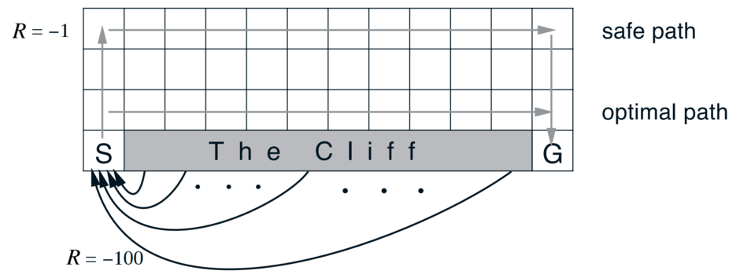

# COMP767_Task_5

## Task

To solve the Cliff World Environment using *REINFORCE*(Monte Carlo Policy Gradient) algorithm.

## Environment

* The environment is a 4 X 12 grid. 
* Reward is −1 on all transitions except those into the region marked “The Cliff.” 
* Stepping into this region incurs a reward of −100 and sends the agent instantly back to the start.

Inline-style: 

Reference:: Example 6.6 - Cliff Walking, An Introduction to Reinforcement Learning, Sutton and Barton, II Edition

## Scripts

There are three different files made for accompolishing the task.
1. **Cliff\_Walk\_Environment.py**
    This defines the *Cliff World* environment defining all the necessary MDP parameters, and functions to evaluate its various aspects.
2. **REINFORCE.py**
    This defines an agent which uses REINFORCE algorithm to learn to act model-free in an environment.
3. **PolicyGradientOnCliffWalk.ipynb**
    This combines the environment and the agent so that the learning process by an agent is performed in a model-free manner in the Cliff World Environment.